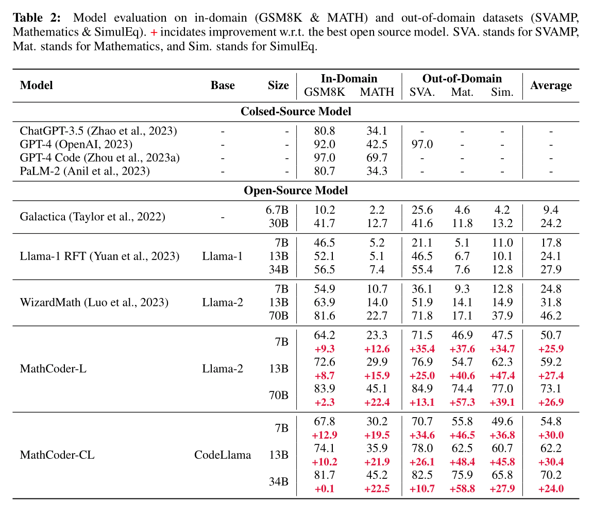
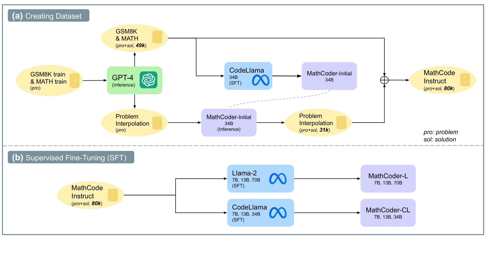

# **MathCoder**
This repo is for "[MathCoder: Seamless Code Integration in LLMs for Enhanced Mathematical Reasoning](https://openreview.net/pdf?id=z8TW0ttBPp)"

🔥🔥🔥 We release "[MathCoder-VL: Bridging Vision and Code for Enhanced Multimodal Mathematical Reasoning](https://openreview.net/pdf?id=lclKPTKM9R)"

<br>
<div align="center">
  
</div>

## 💥 News 💥

- **[2025.05.16]** 🤗 [MathCoder-VL-2B](https://huggingface.co/MathLLMs/MathCoder-VL-2B), [MathCoder-VL-8B](https://huggingface.co/MathLLMs/MathCoder-VL-8B) and [FigCodifier-8B](https://huggingface.co/MathLLMs/FigCodifier) is available now! 🔥🔥🔥
- **[2024.05.20]** 🤗 [MathCodeInstruct Dataset-Plus](https://huggingface.co/datasets/MathLLMs/MathCodeInstruct-Plus) is available now! 🔥
- **[2024.04.29]** 🤗 [MathCodeInstruct Dataset](https://huggingface.co/datasets/MathLLMs/MathCodeInstruct) is available now! 🔥
- **[2024.02.27]** 🚀 [MathGenie](https://mathgenie.github.io/) achieves an accuracy of 87.7% on GSM8K and 55.7% on MATH. 🎉 Congratulations!
- **[2024.02.27]** The inference and evaluation code for MathCoders is available now.
- **[2024.01.16]** 🌟 Our [**MathCoder**](https://openreview.net/forum?id=z8TW0ttBPp) and [**CSV**](https://openreview.net/forum?id=c8McWs4Av0) has been accepted at **ICLR 2024**! 🎉 Cheers!
- **[2023.10.05]** Our work was featured by [Aran Komatsuzaki](https://twitter.com/arankomatsuzaki). Thanks!
- **[2023.10.05]** Our 7B models are available at Huggingface now.
- **[2023.10.05]** Our paper is now accessible at https://arxiv.org/abs/2310.03731.

### Datasets and Models
Our models are available at Hugging Face now.

🤗 [MathCodeInstruct Dataset](https://huggingface.co/datasets/MathLLM/MathCodeInstruct)

| Base Model: Llama-2                                           	| Base Model: Code Llama                                                |
|-------------------------------------------------------------------|-----------------------------------------------------------------------|
|  [MathCoder-L-7B](https://huggingface.co/MathLLM/MathCoder-L-7B)  |  [MathCoder-CL-7B](https://huggingface.co/MathLLM/MathCoder-CL-7B)   	|
|  [MathCoder-L-13B](https://huggingface.co/MathLLM/MathCoder-L-13B)  |  [MathCoder-CL-34B](https://huggingface.co/MathLLM/MathCoder-CL-34B)   	|


## Training Data
The models are trained on the [MathCodeInstruct](https://huggingface.co/datasets/MathLLM/MathCodeInstruct) Dataset.

<br>
<div align="center">
  
</div>


## **Introduction**
The recently released GPT-4 Code Interpreter has demonstrated remarkable proficiency in solving challenging math problems, primarily attributed to its ability to seamlessly reason with natural language, generate code, execute code, and continue reasoning based on the execution output. In this paper, we present a method to fine-tune open-source language models, enabling them to use code for modeling and deriving math equations and, consequently, enhancing their mathematical reasoning abilities.

We propose a method of generating novel and high-quality datasets with math problems and their code-based solutions, referred to as MathCodeInstruct. Each solution interleaves *natural language*, *code*, and *execution results*. 

We also introduce a customized supervised fine-tuning and inference approach. This approach yields the MathCoder models, a family of models capable of generating code-based solutions for solving challenging math problems.

Impressively, the MathCoder models achieve state-of-the-art scores among open-source LLMs on the MATH (45.2\%) and GSM8K (83.9\%) datasets, substantially outperforming other open-source alternatives. Notably, the MathCoder model not only surpasses ChatGPT-3.5 and PaLM-2 on GSM8K and MATH but also outperforms GPT-4 on the competition-level MATH dataset. The proposed dataset and models will be released upon acceptance.
<br>
<div align="center">
  
</div>

## Usage

### Model deployment
We use the Text Generation Inference (TGI) to deploy our MathCoders for response generation.
TGI is a toolkit for deploying and serving Large Language Models (LLMs). TGI enables high-performance text generation for the most popular open-source LLMs, including Llama, Falcon, StarCoder, BLOOM, GPT-NeoX, and T5. Your can follow the guide [here](https://huggingface.co/docs/text-generation-inference/index).
After successfully installing TGI, you can easily deploy the models using `deploy.sh`.
```sh
model_path="local model path"

max_input_tokens=1536
max_total_tokens=2048

set -x
hostname -I # print the host ip

text-generation-launcher --port 8000 \
--max-batch-prefill-tokens ${max_input_tokens} \
--max-input-length ${max_input_tokens} \
--max-total-tokens ${max_total_tokens} \
--model-id ${model_path}
```

### Inference
We provide a script for inference. Just replace the `ip` and `port` in the following command correctly with the API forwarded by TGI like:
```sh
python inference.py --pnum=4 --outdir=outs/debug --ip=10.119.18.159 --port=8001 --type=test --dataset=GSM8K
```
We also open-source all of the model outputs from our MathCoders under the outs/ folder.

### Evaluation
To evaluate the predicted answer, run the following command:
```sh
python evaluate.py outs/MathCoder-L-7b/MATH/MATH_test_result-20230917-2026.jsonl 
```

## **Citation**

Please cite the paper if you use our data, model or code. Please also kindly cite the original dataset papers. 

```
@inproceedings{
wang2024mathcoder,
title={MathCoder: Seamless Code Integration in {LLM}s for Enhanced Mathematical Reasoning},
author={Ke Wang and Houxing Ren and Aojun Zhou and Zimu Lu and Sichun Luo and Weikang Shi and Renrui Zhang and Linqi Song and Mingjie Zhan and Hongsheng Li},
booktitle={The Twelfth International Conference on Learning Representations},
year={2024},
url={https://openreview.net/forum?id=z8TW0ttBPp}
}
```

```
@inproceedings{
zhou2024solving,
title={Solving Challenging Math Word Problems Using {GPT}-4 Code Interpreter with Code-based Self-Verification},
author={Aojun Zhou and Ke Wang and Zimu Lu and Weikang Shi and Sichun Luo and Zipeng Qin and Shaoqing Lu and Anya Jia and Linqi Song and Mingjie Zhan and Hongsheng Li},
booktitle={The Twelfth International Conference on Learning Representations},
year={2024},
url={https://openreview.net/forum?id=c8McWs4Av0}
}
```
